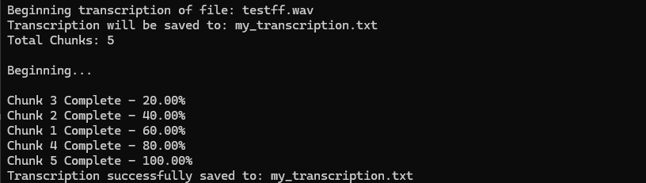

# Speech Transcription with PocketSphinx

This Python script uses the PocketSphinx recognizer from CMU Sphinx to transcribe audio files into text. The script is designed to handle audio chunking for efficient processing and provides real-time progress and estimated completion time as the transcription is performed.

Now with 70% faster with parallelization!

## Description

This script transcribes .wav audio files by:

* Splitting the audio into manageable chunks (e.g., 30 seconds each).

* Processing each chunk with PocketSphinx.

* Outputting a transcription file in .txt format.

**Key Features**:

* Real-time progress display.

* Estimated remaining time calculation.

* Handles audio chunking for large files to improve processing efficiency.

Note: the script will seem to hang when a transcription first begins and reads `Beginning...` do not be alarmed. This happens because many threads have taken chunks to process. They will return at relatively the same time and you'll get a number of completion readouts.


## Installation

**Requirements**

* Ensure that Python 3.6+ is installed.
* Install Python Dependencies:
    * This script requires the speech_recognition library. You can install it via pip:
    ```
    pip install speechrecognition
    ```
* Download PocketSphinx:
    * Clone the PocketSphinx repo from GitHub:
    ```
    git clone https://github.com/cmusphinx/pocketsphinx.git
    ```
    * ***No need to build***. After cloning, make sure to place the ```pocketsphinx``` repo in the correct location. For example, if you cloned the repo to C:/pocketsphinx, set the variable pocketsphinx_repo_path in the script (line 19) to it's path.
* Install FFmpeg (if using non-wav files):
    * If you plan to work with audio files other than ```.wav```, you may need to install FFmpeg to handle file conversion:
        * https://ffmpeg.org/download.html
    * On Ubuntu/Debian-based systems:
        ```
        sudo apt update
        sudo apt install ffmpeg
        ```
    * On Red Hat/CentOS-based systems:
        ```
        sudo yum install ffmpeg
        ```
    * For other Linux distributions, refer to the [FFmpeg official download page](https://ffmpeg.org/download.html).

### Script Configuration
Before running the script, you will need to modify the following variables in the script:
* `pocketsphinx_repo_path`: Set this variable to the directory where you have the cloned PocketSphinx repository. The path should point to the folder containing the PocketSphinx models and dictionaries:

* ```audio_file_path```: Set this variable to the path of the .wav file you want to transcribe:
    * 

* ```output_file_path```: Specify where the output transcription file will be saved:


## Running the Script
Once you’ve completed the installation and configuration:
*  Run the script:
```
python transcribe.py
```

* The script will print the progress of the transcription, including:
    * Real-time progress percentage.

    * Estimated time remaining.

    * The final transcription will be saved to the file specified in `output_file_path`.

## Troubleshooting
* If you encounter errors related to missing dependencies, make sure you have installed the required Python libraries (`speechrecognition`) using the installation command above.
* Ensure that the `pocketsphinx` repo is correctly cloned and that the correct path is set in the script for `pocketsphinx_repo_path`.
* If transcription fails for certain audio formats, ensure you have `FFmpeg` installed to handle conversions.
    * Also see the `PocketSphinx` repo for other multimedia file management and codec software.
* Using `pydub`: If you're working with non-WAV files and need to convert or handle specific formats, you may want to install `pydub` (though this is not required for the script to run):
    ```
    pip install pydub
    ```
### Screenshot


## FAQ

#### Why is the ```speech_recognition``` library needed?

* The `speech_recognition` library provides a high-level interface to different speech recognition engines, including PocketSphinx, Google Web Speech API, and others.


## Acknowledgements

 - https://github.com/cmusphinx
    - https://github.com/cmusphinx/pocketsphinx


